This document began as the detailed implementation handoff for the Gravity lab. Its central
correction remains substantial: the lab should not begin with an eight-particle rope. For ordinary
poi, the scientifically useful baseline is a point mass attached to a massless, inextensible string
that may pull but never push. That gives us an exact unilateral tether model with explicit taut,
slack, release, and catch states.

A particle rope can come later as a comparison for string mass and elasticity. Making it the primary model would quietly change the experiment we are trying to understand.

The implementation-status sections at the end now distinguish completed work from later experiments.

# 1. Problem statement

The Gravity Lab needs to answer several different questions that have previously been blurred together:

1. What initial speed or energy is required to complete a taut vertical circle?
2. What happens when the poi has less energy?
3. How much ongoing work is required to maintain constant speed?
4. How does moving the hand add or remove energy?
5. How do a physical pendulum and a physical circle compare when they share the same gravity and tether length?
6. Which parts of this physics should eventually inform the kinematic engine?

These are not one experiment and should not share one vague “energy” slider.

The lab should live at `/lab/gravity`. Physics remains in `src/lab/`; it must not alter the deterministic engine or pendulum driver.

# 2. Holes in Luna’s previous proposal

The earlier proposal was directionally useful, but incomplete in ways that would produce misleading results.

## The particle rope changes the system

Eight equal-mass particles do not approximate a massless poi string. They create a rope with substantial distributed mass. Reducing each particle’s mass does not cleanly solve this because the numerical system becomes increasingly ill-conditioned.

The ideal poi baseline needs only:

- a kinematic hand point;
- a dynamic poi mass;
- a maximum-distance tether constraint.

A discrete rope is a separate physical model with an explicit rope-mass ratio.

## Tangential drive at the poi is not hand input

Applying a tangential force directly to the poi is useful as an abstract actuator, but it is not how a performer normally transfers energy through a string.

A string transmits radial tension. Hand input must ultimately come from hand position, velocity, and acceleration. The abstract actuator can remain as a teaching experiment, but it must be labelled honestly.

## “Minimum effort” is undefined

At least six plausible objectives exist:

- minimum initial energy;
- minimum positive work;
- minimum total absolute work;
- minimum peak power;
- minimum peak tension;
- minimum muscular effort.

They do not produce the same solution.

A gravity-led ballistic loop needs zero ongoing tangential work after launch, but it begins with substantial kinetic energy and can produce high tension. That is not necessarily minimum human effort.

The accurate public label is **gravity-led taut circle**. The more technical label is **minimum-energy taut ballistic loop**.

## Less energy is not one knob

There are three distinct cases:

- less launch energy;
- less continuous actuator power;
- a smaller or badly timed hand movement.

The Gravity Lab should implement these as separate experiments.

## Taut/slack transitions were missing

A string cannot supply negative tension. When the calculated tension reaches zero, the poi becomes a free projectile. When it reaches the end of the string again, there is a catch impulse.

Simply projecting it back onto a circle every frame hides this transition and creates timestep-dependent energy gains or losses.

## Catch physics was unspecified

When a slack string becomes taut, the outward radial velocity must be removed. That generally loses energy. The model needs an explicit catch restitution policy, with an inelastic catch as the default.

## “Tension from PBD corrections” is not automatically tension

Ordinary position corrections are not calibrated forces. If we later use a particle rope, XPBD is preferable because it reduces timestep/iteration dependence and provides constraint-force estimates. That is precisely the problem XPBD was designed to improve. [XPBD paper](https://doi.org/10.1145/2994258.2994272)

The ideal one-particle model can calculate tension directly from mechanics and should be the oracle.

## The units in the superseded prototype were misleading

The removed Pendulum-lab taut-circle prototype used a `gravity` control that was effectively a
dimensionless gravity ratio, not physical acceleration. Its `circleRate` was a reference frequency,
not necessarily the resulting number of completed circles per unit.

The Gravity Lab must state its units and show normalized quantities explicitly.

## A kinematic visualizer is the wrong renderer

Physics playback is stateful. Slack, catch events, and accumulated work depend on earlier states. It cannot be evaluated safely as an arbitrary stateless engine pose.

The Gravity Lab needs its own 2D canvas driven by a precomputed deterministic simulation trace. `EmbeddedVisualizer` should not be used as the physics runtime.

## No numerical validation contract existed

A plausible-looking rope is not enough. We need analytic thresholds, energy conservation, event accuracy, convergence, and repeatability tests.

# 3. Model options

| Model                    | Strength                                       | Failure mode                             | Role                   |
| ------------------------ | ---------------------------------------------- | ---------------------------------------- | ---------------------- |
| Ideal unilateral tether  | Exact tension and clean taut/slack physics     | Cannot show string sag or mass           | Primary model          |
| Low-resolution XPBD rope | Shows massive rope, slack shape and elasticity | Numerical parameters affect results      | Later comparison       |
| General physics engine   | Useful for collisions and rigid bodies         | Adds machinery we explicitly do not need | Reject                 |
| Pure kinematic curve     | Easy to author and synchronize                 | Cannot discover physical failure         | Reference overlay only |

Recommendation: build the ideal tether first, then optionally add an eight-particle XPBD comparison. No external physics engine is warranted.

# 4. Physics contract

Use a 2D wall plane:

- \(x\): right;
- \(y\): up;
- gravity: \(\mathbf g=(0,-g)\);
- hand: \(\mathbf H(t)\);
- poi: \(\mathbf P(t)\);
- tether length: \(L\);
- poi mass: \(m\).

Measure the relative angle \(\theta\) from downward vertical:

\[
\mathbf e_r =
\begin{bmatrix}
\sin\theta\\
-\cos\theta
\end{bmatrix},
\qquad
\mathbf e_t =
\begin{bmatrix}
\cos\theta\\
\sin\theta
\end{bmatrix}.
\]

When taut:

\[
\mathbf P=\mathbf H+L\mathbf e_r.
\]

Therefore:

\[
\dot{\mathbf P}
=
\dot{\mathbf H}
+
L\dot\theta\mathbf e_t.
\]

and

\[
\ddot{\mathbf P}
=
\ddot{\mathbf H}
+
L\ddot\theta\mathbf e_t
-
L\dot\theta^2\mathbf e_r.
\]

## Tangential equation

With an optional abstract generalized torque \(\tau\):

\[
\ddot\theta
=
-\frac{g}{L}\sin\theta
-\frac{\ddot{\mathbf H}\cdot\mathbf e_t}{L}
+\frac{\tau}{mL^2}.
\]

This equation clearly separates:

- gravity;
- moving-hand forcing;
- an explicitly artificial angular actuator.

## Tension

Without an additional radial force:

\[
T
=
m\left(
L\dot\theta^2
+
g\cos\theta
-
\ddot{\mathbf H}\cdot\mathbf e_r
\right).
\]

The tether can remain taut only while:

\[
T\ge0.
\]

When the required \(T\) becomes negative, the taut solution is physically invalid and must transition to slack flight.

## Fixed-hand energy

For \(\mathbf H=0\), measure potential energy from the bottom:

\[
E
=
\frac12mL^2\dot\theta^2
+
mgL(1-\cos\theta).
\]

Define normalized bottom speed:

\[
u_0=\frac{v_{\text{bottom}}}{\sqrt{gL}}.
\]

While taut and unforced:

\[
\frac{v(\theta)^2}{gL}
=
u_0^2-2+2\cos\theta.
\]

Tension becomes:

\[
\frac{T(\theta)}{mg}
=
u_0^2-2+3\cos\theta.
\]

This produces five meaningful launch regimes:

- \(u_0<\sqrt2\): ordinary taut pendulum; it reverses before horizontal.
- \(u_0=\sqrt2\): reaches horizontal with zero speed and zero tension.
- \(\sqrt2<u_0<\sqrt5\): rises above horizontal, releases, and enters slack flight.
- \(u_0=\sqrt5\): limiting taut loop.
- \(u_0>\sqrt5\): taut loop with positive top tension.

For the intermediate regime, release occurs at:

\[
\cos\theta_{\text{release}}
=
\frac{2-u_0^2}{3}.
\]

This is the first experiment’s central result. “Putting less energy in” should visibly move the system from taut loop, through slack-and-catch motion, into an ordinary pendulum.

## Limiting taut loop

At the boundary:

\[
v_{\text{top}}^2=gL.
\]

The complete speed profile is:

\[
v(\theta)^2
=
gL(3+2\cos\theta).
\]

Therefore:

\[
v_{\text{bottom}}=\sqrt{5gL},
\qquad
v_{\text{side}}=\sqrt{3gL},
\qquad
v_{\text{top}}=\sqrt{gL}.
\]

Tension is:

\[
T(\theta)=3mg(1+\cos\theta).
\]

The required launch energy is:

\[
E_0=\frac52mgL.
\]

Its period is:

\[
T_{\text{loop}}
=
\frac4{\sqrt5}
K\left(\frac2{\sqrt5}\right)
\sqrt{\frac Lg}
\approx
4.03781164\sqrt{\frac Lg}.
\]

## Constant-speed circle

For constant speed \(v_c\):

\[
T(\theta)
=
m\left(
\frac{v_c^2}{L}
+
g\cos\theta
\right).
\]

It remains taut only if:

\[
v_c^2\ge gL.
\]

The tangential torque required to cancel gravity is:

\[
\tau=mgL\sin\theta.
\]

Power is:

\[
P=\tau\dot\theta.
\]

At the limiting constant speed:

- positive work while climbing: \(2mgL\);
- negative work while descending: \(-2mgL\);
- net work: \(0\);
- total absolute work: \(4mgL\).

This is why “net work is zero” does not mean “no control.”

## Moving-hand work

The tether force on the poi is:

\[
\mathbf F_T=-T\mathbf e_r.
\]

Its power transfer through a moving hand is:

\[
P_{\text{hand}}
=
-T\dot{\mathbf H}\cdot\mathbf e_r.
\]

This is the physically meaningful hand-energy metric.

It also clarifies an important point: instantaneous string work depends on the hand’s radial velocity relative to the tether. Hand acceleration along the tangent changes the relative angular dynamics, but energy transfer must still balance through the complete moving-constraint calculation.

## Slack flight

While slack:

\[
\ddot{\mathbf P}=\mathbf g
\]

before drag or other forces are added.

The hand continues moving independently. Define:

\[
C(t)=|\mathbf P-\mathbf H|-L.
\]

Slack flight is valid while \(C<0\). A catch occurs when:

\[
C=0
\]

and the relative radial velocity is outward:

\[
u_r^-=
(\dot{\mathbf P}-\dot{\mathbf H})\cdot\mathbf e_r>0.
\]

For catch restitution \(e_c\):

\[
u_r^+=-e_cu_r^-.
\]

The default should be:

\[
e_c=0,
\]

an inelastic catch that removes the outward radial velocity and returns to the taut state.

The catch must be located inside the timestep using deterministic bisection. End-of-step clamping is not accurate enough.

```mermaid
stateDiagram-v2
    [*] --> Taut
    Taut --> Slack: "required tension drops below zero"
    Slack --> Taut: "boundary reached outward; inelastic catch"
    Taut --> Taut: "tension remains nonnegative"
    Slack --> Slack: "poi remains inside tether radius"
```



# 5. The important calibration finding

The existing convention that one full pendulum cycle and one circle both occupy one authored unit is musically useful, but it is not produced naturally by gravity.

For the same \(L\) and \(g\):

\[
T_{\text{pendulum},90^\circ}
\approx
7.41629871\sqrt{\frac Lg},
\]

\[
T_{\text{constant threshold circle}}
=
6.28318531\sqrt{\frac Lg},
\]

\[
T_{\text{gravity-led taut loop}}
\approx
4.03781164\sqrt{\frac Lg}.
\]

So a natural \(90^\circ\) pendulum takes approximately:

- \(1.18\times\) as long as the slowest constant-speed taut circle;
- \(1.84\times\) as long as the limiting ballistic taut circle.

This means there is no single gravity-derived “speed 1” that automatically makes a natural pendulum cycle equal a natural taut circle.

The observed Rastaxel equality therefore implies active control, altered effective radius, moving-hand forcing, or deliberate time warping. That is not a problem—it is probably the key discovery.

# 6. Gravity Lab structure

Create a separate `/lab/gravity` article-and-experiment page.

## Section 1: Gravity is a force, not a curve

Explain that gravity always accelerates downward. The visible speed curve is produced by the combination of:

- gravity;
- tether constraint;
- initial state;
- hand motion;
- active input;
- dissipation.

Show the coordinate system and equations.

## Experiment 1: Launch a loop

Fixed hand, no drive, no drag.

Visible controls:

- launch speed \(u_0\), or linked launch energy \(E_0/(mgL)\);
- gravity;
- tether length;
- direction;
- reset/play/scrub.

The main slider should cross the important values:

- \(\sqrt2\);
- \(\sqrt5\).

Outputs:

- taut/slack/catch animation;
- trail;
- velocity vector;
- normalized speed;
- normalized tension;
- radius ratio \(|P-H|/L\);
- mechanical energy;
- event markers;
- classification: pendulum, slack orbit, limiting loop, safe loop.

This is the highest-value first implementation.

## Timing calibration and Experiment 2: small hand motion

Keep physical time and authored timing visibly separate. A \(90^\circ\) gravity pendulum normalized
to one cycle has a bottom speed about \(1.669\times\) a uniform one-circle-per-unit motion, even
though its average absolute angular travel can match. The constant-speed taut circle is an analytic
target/reference, not a claim about a positive-only actuator.

Compare the fixed-hand gravity trace with a deterministic prescribed hand path. Start with an
ellipse as the default because it can separate horizontal and vertical hand travel; retain circle
and horizontal/vertical line modes so each geometric ingredient can be isolated.

Controls:

- shared launch energy, gravity, and tether length;
- path shape: ellipse, circle, or line;
- horizontal and vertical amplitudes as fractions of \(L\);
- line axis;
- path frequency, phase, and direction;
- playback and scrub.

Outputs:

- fixed-hand and moving-hand animations side by side;
- relative tether speed and world head speed;
- tension and taut/slack events;
- gravity power and hand power;
- radial hand velocity;
- tangential and radial hand acceleration retained in the trace for later inspection;
- positive and negative hand work;
- energy-balance residual;
- one-loop speed ripple and phase scan;
- cardinal and release/catch markers;
- the constant-speed analytic reference retained for tests and a later target overlay.

The hand path must return analytic position, velocity, and acceleration. The phase scan reruns one
complete poi loop for each phase and reports speed ripple, minimum tension, hand work, and ledger
residual. It is a measurement surface, not an optimizer: it shows which timing relationships are
promising before we search over more path parameters.

## Experiment 3: Abstract drive

Keep the hand fixed and introduce an explicitly labelled generalized torque.

Policies:

- no drive;
- fractional gravity cancellation:
  \[
  \tau=\kappa mgL\sin\theta;
  \]
- positive-only assistance;
- bidirectional speed regulation.

Controls:

- drive fraction;
- maximum torque;
- maximum power;
- whether negative work is allowed.

This experiment answers “what happens when the actuator cannot supply enough power?” It must not be described as literal hand motion.

## Experiment 4: General moving-pivot paths

Use prescribed analytic hand paths that provide exact position, velocity, and acceleration:

\[
H_x(t)=A_x\sin(\omega_ht+\phi_x),
\]

\[
H_y(t)=A_y\sin(\omega_ht+\phi_y).
\]

The first implementation now supports:

- fixed hand;
- horizontal line;
- vertical line;
- ellipse;
- circle;
- horizontal or vertical sinusoidal line.

Controls:

- path shape;
- amplitude;
- frequency;
- phase;
- direction.

Outputs add:

- hand power;
- positive and negative hand work;
- peak tension;
- peak hand power;
- energy-balance residual.

The amplitude and phase controls provide the physical version of “put less energy in.” Work will not necessarily vary monotonically with amplitude because timing matters.

## Experiment 5: Circle versus pendulum calibration

Compare, under the same \(L\) and \(g\):

- physical \(90^\circ\) pendulum;
- limiting constant-speed taut circle;
- gravity-led taut loop;
- authored one-cycle-per-unit curves.

Show explicitly which durations are physical and which are normalized conventions.

A later Rastaxel overlay can use these traces, but it should not be part of the initial solver milestone.

## Experiment 6: Massive-string comparison

Optional final section:

- ideal massless tether;
- eight-particle massive rope;
- explicit rope-mass ratio;
- optional compliance.

Use XPBD inequality constraints:

\[
C_i=|\mathbf x_i-\mathbf x_{i-1}|-\ell_i\le0.
\]

This section demonstrates how string mass and numerical resolution change the result. Particle count and solver iterations belong under “numerical controls,” not alongside physical controls.

# 7. Graph and diagnostic contract

Every numerical experiment should produce a precomputed trace.

Primary plots:

- speed \(v/\sqrt{gL}\);
- tension \(T/(mg)\);
- radius ratio \(|P-H|/L\);
- mechanical energy \(E/(mgL)\);
- source power;
- cumulative work.

Display taut and slack intervals as graph backgrounds. Add cardinal-event lines for bottom, side, top, and side when those events occur.

Summary metrics:

- outcome classification;
- first release time and phase;
- number of catches;
- minimum tension;
- maximum tension;
- minimum top speed;
- positive work;
- negative work;
- absolute work;
- peak power;
- energy-balance residual;
- numerical error estimate.

“Constraint response” should only appear in the XPBD experiment. The ideal tether reports actual model tension.

# 8. Solver design for Luna

Implemented source structure:

```text
src/lab/experiments/gravity/
  GravityLabPage.vue
  routeMeta.ts
  GravityCanvas.vue
  GravityTracePlot.vue
  GravityComparisonPlot.vue
  GravityPhaseScanPlot.vue
  MathEquation.vue
  LaunchEnergyExperiment.vue
  MovingHandExperiment.vue
  physics/
    vector2.ts
    types.ts
    handPaths.ts
    diagnostics.ts
    idealTether.ts
    analyticReferences.ts
    constantSpeedCircle.ts
```

Core state:

```ts
type TetherState =
  | {
      readonly mode: "taut";
      readonly time: number;
      readonly theta: number;
      readonly omega: number;
    }
  | {
      readonly mode: "slack";
      readonly time: number;
      readonly poiPosition: Vec2;
      readonly poiVelocity: Vec2;
    };
```

Hand paths must return all three values analytically:

```ts
interface HandKinematics {
  readonly position: Vec2;
  readonly velocity: Vec2;
  readonly acceleration: Vec2;
}
```

Simulation requirements:

- pure function;
- fixed timestep;
- no wall-clock dependency;
- no randomness;
- deterministic fixed-count event bisection;
- no silent input correction;
- invalid configuration returns structured errors;
- precompute trace on control changes;
- interpolate trace only for display;
- playback never advances the physics independently.

Recommended integration:

- fixed-step RK4 for the taut angular equation;
- exact constant-gravity free-flight update while slack;
- split timesteps at release and catch events;
- 24 fixed bisection iterations for deterministic event localization;
- default timestep around \(1/480\) simulation units, then validate convergence rather than trusting that number.

Maintain an energy ledger:

\[
\Delta E
\approx
W_{\text{hand}}
+
W_{\text{drive}}
+
W_{\text{drag}}
+
W_{\text{boundary}}
-
E_{\text{dissipated}}.
\]

The residual is a first-class diagnostic. If it becomes large, the experiment should display “numerical result unreliable.”

# 9. Math rendering

Install KaTeX locally. Do not load it from a CDN.

A small `MathEquation.vue` should call `katex.renderToString()` with:

- `displayMode`;
- `throwOnError: false`;
- `output: "htmlAndMathml"`.

KaTeX supports the major browsers, including Firefox, and its default combined output provides HTML for display plus MathML for accessibility. [KaTeX browser support](https://katex.org/docs/browser.html), [KaTeX output options](https://katex.org/docs/options)

This is preferable to global MathJax for this lab. MathJax is more capable, but dynamic Vue content requires explicit asynchronous re-typesetting and lifecycle cleanup. [MathJax dynamic-content documentation](https://docs.mathjax.org/en/latest/advanced/typeset.html)

Do not add a Markdown math plugin initially. The repository already has Markdown-to-Vue support, but a direct trusted equation component is smaller and more predictable.

# 10. Validation plan

## Analytic oracle tests

With \(m=L=g=1\):

- limiting loop bottom speed: \(\sqrt5\);
- side speed: \(\sqrt3\);
- top speed: \(1\);
- bottom tension: \(6\);
- side tension: \(3\);
- top tension: \(0\);
- total energy: \(2.5\);
- period: \(4.03781164\).

For constant speed \(v=1\):

- top tension: \(0\);
- positive work: \(2\);
- negative work: \(-2\);
- absolute work: \(4\).

For \(2<u_0^2<5\), verify release phase:

\[
\cos\theta_{\text{release}}=\frac{2-u_0^2}{3}.
\]

## Hybrid-state tests

- tension never becomes negative while state is taut beyond tolerance;
- slack state never exceeds the tether radius except during a located catch event;
- an inelastic catch removes outward relative radial velocity;
- release preserves world position and velocity;
- catch preserves position and tangential relative velocity;
- event ordering is deterministic.

## Numerical tests

- identical input produces identical trace values;
- halving timestep converges toward the analytic result;
- energy drift stays below a declared threshold;
- energy ledger closes within tolerance;
- invalid negative mass, length, gravity, timestep, or duration is rejected;
- simulation has a hard maximum step count.

## UI tests

- controls work in Firefox and Chromium;
- no reliance on browser-styled `<select>` behaviour for essential mode selection;
- graphs remain legible at narrow widths;
- scrubbing does not change simulation results;
- equations include accessible MathML;
- the Gravity route appears in lab navigation.

## Repository verification

- lint;
- Vue-aware typecheck;
- focused physics tests;
- full test suite;
- production build.

# 11. Migration impact

The superseded gravity-circle prototype lived under the Pendulum lab:

- `MinimumEffortCircleExperiment.vue`;
- `tautCircleMath.ts`;
- `tautCircleMath.test.ts`.

The implementation:

1. Created `/lab/gravity`.
2. Moved the useful analytic material into the Gravity lab.
3. Removed the superseded gravity experiment from the Pendulum lab.
4. Hard-updated imports and tests without compatibility aliases.
5. Added the Gravity lab link and lazy route.
6. Updated [ARCHITECTURE.md](/Users/rory/code/poi-viz/docs/ARCHITECTURE.md) and `research/decisions.md`.
7. Kept every new physics type out of `src/engine/`.

# 12. Implementation order

Luna should not attempt every experiment in one pass.

Completed:

1. Gravity route, KaTeX component, and article shell.
2. Pure analytic-reference module and tests.
3. Ideal tether hybrid solver and energy ledger.
4. Launch-energy experiment with canvas and graphs.
5. Ellipse, circle, and line moving-hand paths with exact derivatives.
6. One-loop diagnostics, cardinal/event markers, phase scan, and convergence tests.
7. Physical pendulum/circle timing calibration copy.

Next:

1. Add an abstract-drive experiment only if direct actuator limits remain a useful teaching question.
2. Add analytic velocity to the built-in kinematic drivers for calibrated comparisons.
3. Compare the Gravity trace with measured hand and poi trajectories.
4. Add the optional XPBD rope only when string mass or elasticity becomes the question.

The XPBD comparison remains deliberately optional: it is valuable, but it should not delay
validation of the ideal-tether and moving-pivot experiments.
